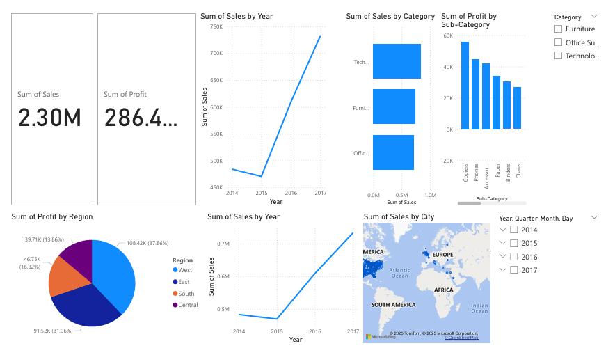

# 📊 Power BI Sales Dashboard — Retail Analysis (2014–2017)

This is a beginner-friendly Power BI dashboard I built to explore and analyze sales data from a fictional retail company. The main goal was to visualize important business insights like top-performing regions, sales trends over time, and profitability by category — all in a clean and interactive way.

---

## 📁 Dataset Summary

- **Source**: Sample Superstore Sales Dataset (commonly used for Power BI practice)
- **Duration Covered**: 2014 – 2017
- **Total Records**: ~1000 rows
- **Key Fields**:
  - `Order Date`, `Ship Mode`, `Customer Name`, `Segment`
  - `Country`, `City`, `State`, `Region`
  - `Product Category`, `Sub-Category`, `Product Name`
  - `Sales`, `Profit`, `Quantity`, `Discount`

---

## 📌 What I Built (Key Visuals)

### 1. **KPI Cards**
- Shows overall **Sales** and **Profit** at the top of the report for quick insights.

### 2. **Sales Trend (Line Chart)**
- Displays monthly/annual sales patterns across the years.

### 3. **Profit by Region (Pie Chart)**
- Highlights which region contributes most to the company’s profit.

### 4. **Sales by City (Map Visual)**
- Geographical view showing top-performing cities.

### 5. **Category-wise Sales (Bar Chart)**
- Compares sales between Furniture, Office Supplies, and Technology.

### 6. **Interactive Filters (Slicers)**
- Added filters to select data by `Category`, `Year`, or `Region` to explore different perspectives easily.

---

## 🛠 Tools & Skills Used

| Tool        | Purpose                                |
|-------------|-----------------------------------------|
| Power BI    | Visualizations, filtering, KPIs, layout |
| Power Query | Data cleaning, transforming columns     |
| Excel (CSV) | Raw data source format                  |

---

## 🔍 Insights Discovered

- **Technology** is the most profitable category.
- **The West region** had the highest profit overall.
- **2015** saw a slight dip in total sales compared to other years.
- Some cities contribute heavily to revenue while others need improvement.

---

## 📷 Dashboard Preview

> You can find the final dashboard screenshot below. All visuals are aligned cleanly with a minimalistic, easy-to-read design.

## 📊 Dashboard Preview

---

## 📥 How to Run This Project

1. Download the `.pbix` file from this repository.
2. Open it using **Power BI Desktop** (free tool).
3. Interact with the filters/slicers to explore different views.
4. Export as PDF or publish to Power BI Service if required.

---

## 📬 Contact

- **Created by**: Vummadisingh Kalyan
- **LinkedIn**: https://www.linkedin.com/in/vk18phoenix/
- **Email**: vkalyan782@gmail.com

---

> 🎯 *This was one of my first Power BI projects, and it helped me understand the complete process of loading data, cleaning it, building visuals, and telling a story with data. Excited to build more!* 🚀
